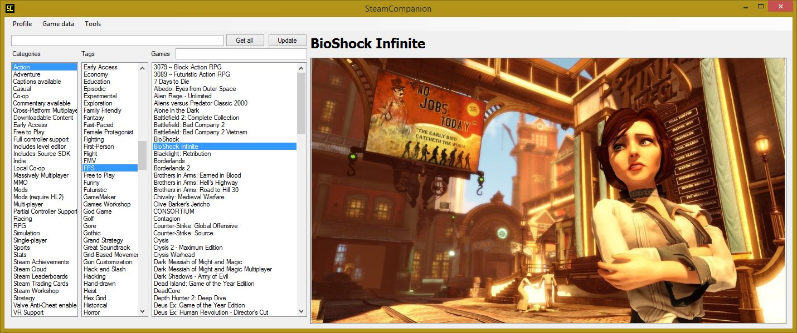
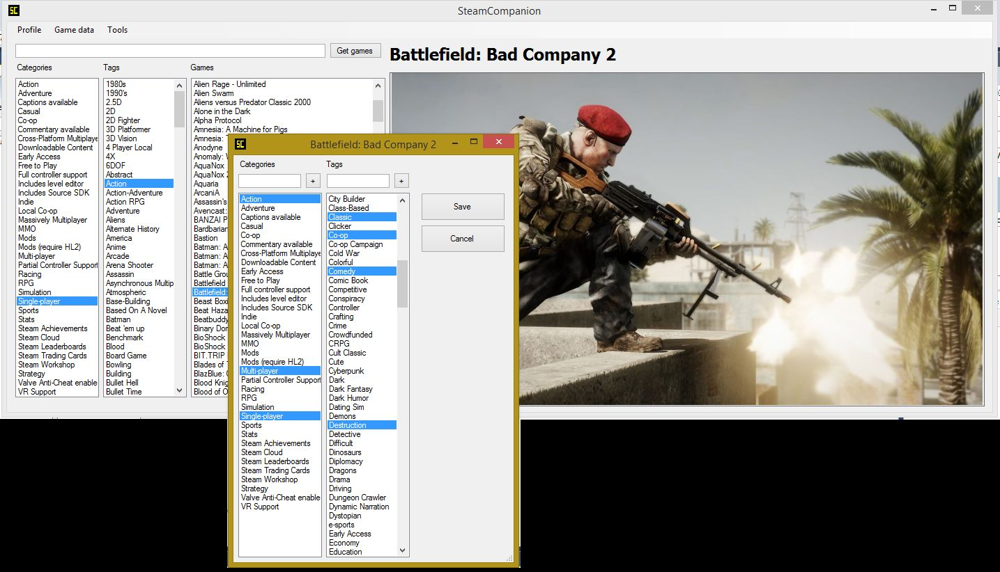

# SteamCompanion
Manage your Steam games

Do you have hundreds of games and you don't know what half of them even look like? SteamCompanion can help you

# Getting started

Input your username, press "Get all" and the application will get your list of games from Steam (uses your Steam Community web profile)
You'll get a list with your games (without genred or images)

You can now download genres and tags or images from the Steam Store using the "Game data" menu. You can download them for the selected games or for all the games.

(Note: "All games" uses the list of games shown at the moment, so you can search for a term or filter the list by tags and then download images for only the shown games)

Getting the data or images can take a while. A console window will tell you the progress so you know the program is working.

I suggest batch-resizing the downloaded images to 720p or lower. My initial test for 900 games produced 5+gb of images and, after resizing them and saving at 80% quality with IrfanView, got reduced to 1gb)

You should now have a list with all your games, tags, categories and images. I'd recommend saving the list using Profile -> Save profile.

Whenever you want to update your list with new games, just input your username and press Update. The program will check all the games from your Steam profile that aren't on your list and prompt you asking if you want to add it or not (maybe you already cleaned your list a bit removing duplicates and don't want them readded again)

# Controls

## Menu bar

Profile: You can save and load the current list to a XML file. If you press "Autosave/load", the program will save the current list as autosave.xml whenever you exit and load it again when you start.
When you save or load profiles you are saving **the whole list of games**, not just the ones currently being shown on the "Games" list.

Game data: Get categories and tags or images for the selected game or the currently showing list of games

Tools: Let's you see a list of the games without genres/tags or images, so you can edit them manually or add screenshots. Useful to find things like games no longer on Steam.

## Main window

If you click on categories and tags, you'll select or unselect them and the game list will change to show the games that have the selected genres and tags.

You can search for a game using the text box on top of the games list. It'll search for whatever you typed anywhere on the game's name and it's not case sensitive.

Double click on any game will open the tag and genre editor (more about that later)

### Key shortcuts

All of these work when the list of games is the "active" part of the window (when you clicked on it or tabed to it)

* Right direction key: Shows the next image for the selected game

* Left direction key: Jumps to a random game on the current list

* Enter: Launch the selected game

* Space: Open the selected game's screenshot folder. You can then add your own jpgs there and they will load when you select the game again

* Delete: It will remove the game from the list and delete all the images from the game's folder. **It will prompt you before deleting it**.

# Tag editor

When you double click a game you'll get this window.

The current genres and tags for that game will be selected already. Just select all the tags/genres you want or add your own by writing them and pressing the "+" button.
